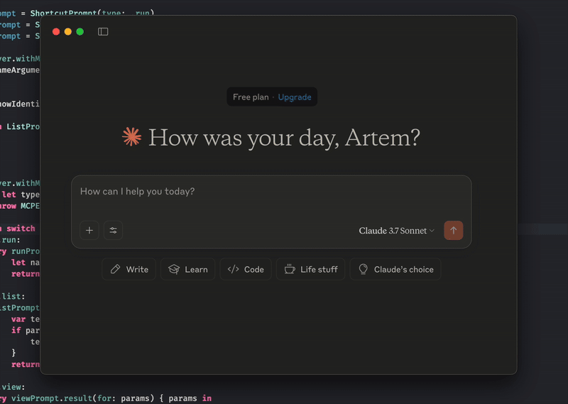
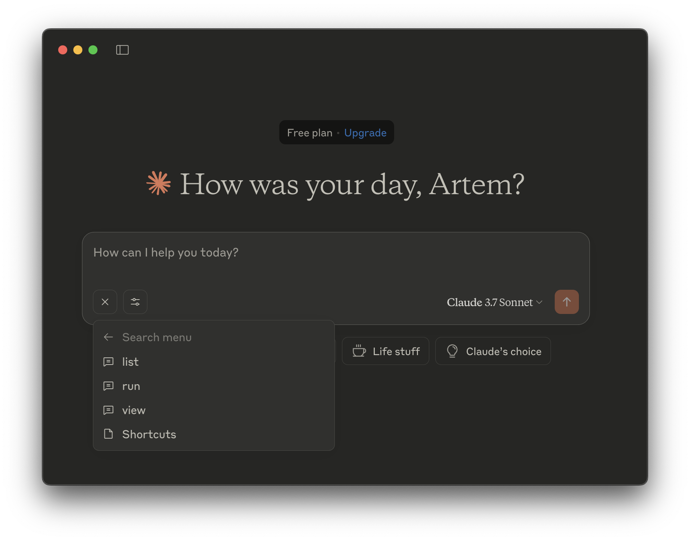

# shortcuts-mcp-server

[](https://swiftpackageindex.com/artemnovichkov/shortcuts-mcp-server)
[](https://swiftpackageindex.com/artemnovichkov/shortcuts-mcp-server)

A Model Context Protocol (MCP) server that provides access to Apple Shortcuts functionality. This server allows AI assistants to list, view, and run your shortcuts through the MCP interface.

Compatible with Cursor, Claude Desktop, and other MCP-enabled applications.



## Getting started

### Prerequisites

- macOS 14.5 or later
- Xcode 16.x or later
- mise

### Setup with mise

To install mise:
```bash
brew install mise
# spm backend is experimental
mise settings experimental=true
```

For more information about mise, visit the [official documentation](https://mise.jdx.dev/).

### Adding to MCP clients

<details>
<summary>Cursor</summary>

For project cofiguration, update `.cursor/mcp.json` file in your project directory. To use across all projects, create a `~/.cursor/mcp.json` file in your home directory.

```json
{
  "servers": {
    "shortcuts-mcp-server": {
      "command": "mise",
      "args": [
        "x",
        "spm:artemnovichkov/shortcuts-mcp-server@latest",
        "--",
        "shortcuts-mcp-server"
      ]
    }
  }
}
```

Don't forget to replace the path to the executable.

[Read more](https://docs.cursor.com/context/model-context-protocol)

</details>

---

<details>
<summary>Claude Desktop</summary>

1. Open Settings -> Developer -> Edit Config
2. Open the config file at `~/Library/Application Support/Claude/claude_desktop_config.json` and update to:

```json
{
  "mcpServers": {
    "shortcuts-mcp-server": {
      "command": "mise",
      "args": [
        "x",
        "spm:artemnovichkov/shortcuts-mcp-server@latest",
        "--",
        "shortcuts-mcp-server"
      ]
    }
  }
}
```

Don't forget to replace the path to the executable.

3. Restart Claude Desktop.

[Read more](https://modelcontextprotocol.io/quickstart/user)

</details>

---

<details>
<summary>VS Code</summary>

[](https://insiders.vscode.dev/redirect/mcp/install?name=shortcuts-mcp-server&config=%7B%22command%22%3A%22mise%22%2C%22args%22%3A%5B%22x%22%2C%22spm%3Aartemnovichkov%2Fshortcuts-mcp-server%40latest%22%2C%22--%22%2C%22shortcuts-mcp-server%22%5D%7D)

For manual installation, add the following JSON block to your User Settings (JSON) file in VS Code. You can do this by pressing `Ctrl + Shift + P` and typing `Preferences: Open User Settings (JSON)`.

```json
{
  "servers": {
    "shortcuts-mcp-server": {
      "command": "mise",
      "args": [
        "x",
        "spm:artemnovichkov/shortcuts-mcp-server@latest",
        "--",
        "shortcuts-mcp-server"
      ]
    }
  }
}
```

Don't forget to replace the path to the executable.

[Read more](https://code.visualstudio.com/docs/copilot/chat/mcp-servers)

</details>

---

<details>
<summary>Github Copilot for Xcode</summary>
  
Open Settings -> MCP -> Edit Config and update to:

```json
{
  "servers": {
    "shortcuts-mcp-server": {
      "command": "mise",
      "args": [
        "x",
        "spm:artemnovichkov/shortcuts-mcp-server@latest",
        "--",
        "shortcuts-mcp-server"
      ]
    }
  }
}
```

Don't forget to replace the path to the executable.

</details>

## Usage

Just ask LLM to run a shortcut, show a list of added shortcuts or view a shortcut in Shortcuts app. 

If your MCP client supports Prompts and Resources you may check it as well:


## Tools

- **run** - Run a shortcut.
    - `name` - The name of the shortcut to run (string, required)
- **list** - List your shortcuts.
    - `show-identifiers` - Whether to show the identifiers of the shortcuts. (boolean, optional)
- **view** - View a shortcut in Shortcuts app.
    - `name` - Name of the shortcut to view (string, required)
    
## Resources

- **list** - List your shortcuts.

## Prompts

- **run** - Run a shortcut.
    - `name` - Name of the shortcut to run (string, required)
- **list** - List your shortcuts.
    - `show-identifiers` - Whether to show the identifiers of the shortcuts. (boolean, optional)
- **view** - View a shortcut in Shortcuts app.
    - `name` - Name of the shortcut to view (string, required)

## References

- [Run shortcuts from the command line](https://support.apple.com/en-kz/guide/shortcuts-mac/apd455c82f02/mac)
- [List of helpful links for shortcuts information](https://www.reddit.com/r/shortcuts/comments/gzjgbr/list_of_helpful_links_for_shortcuts_information/)
- [Shortcuts Library](https://matthewcassinelli.com/sirishortcuts/library/)
- [Shortcuts Directory](https://shortcuts.directory)
